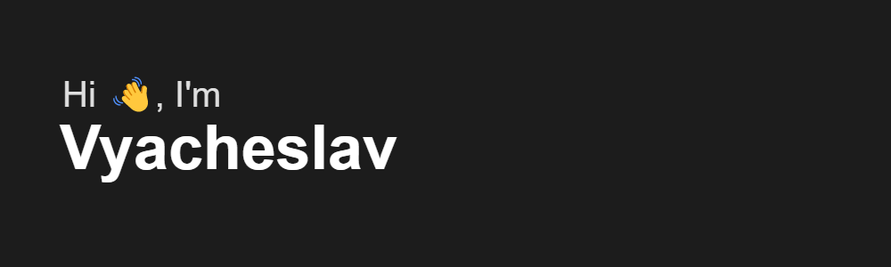

## 👨‍💻 Обо мне
В 2017 году я приступил к обучению в школе программирования "Шуруп", и с тех пор я развиваюсь в сфере веб-разработки на платформе .NET. За это время я приобрел обширный опыт, работая как фрилансером, как в офисе, так и официально на удаленке, суммарно около 4х лет рабочий стаж. Я оттачивал свои навыки, пробуя различные технологии. Также я успешно окончил Крымский Федеральный университет по специальности "прикладная математика" в 2023 году.

**🏠 Дом**
* Страна: **Россия**
* Город: **Челябинск**
* Часовой пояс: **МСК+2**

## 🤝 Связь со мной

  <a href="https://t.me/xventrux" target="_blank" style="text-decoration: none;">
    &nbsp;
  </a>
  

## 💻 Технологии

  &nbsp;
  &nbsp;
  &nbsp;
  &nbsp;
  &nbsp;
  &nbsp;
  &nbsp;
  &nbsp;
  &nbsp
  &nbsp;

## 🛠 Инструменты

  &nbsp;
  &nbsp;
  &nbsp;
  &nbsp;

